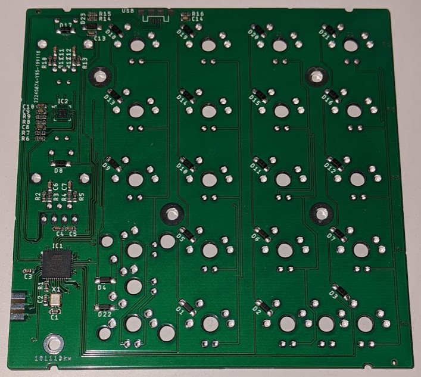
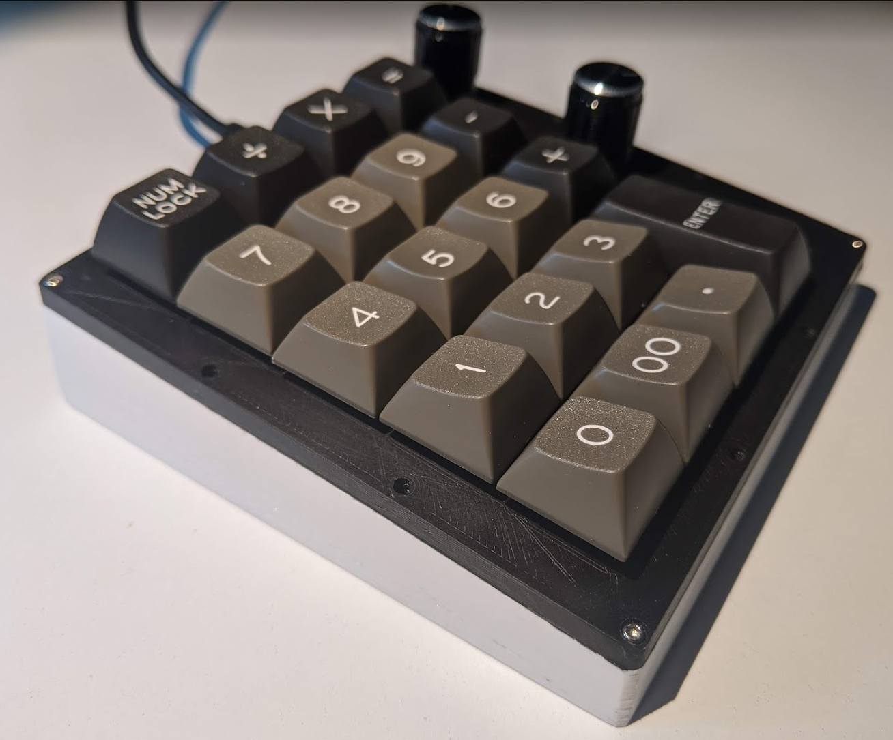

# NumPad

A custom built 5x4 key numpad with encoders and display.

More Info on this [Reddit Thread](https://www.reddit.com/r/MechanicalKeyboards/comments/e81bfg/custom_built_numpad_with_encoders_and_display/)

## Circuit Board



The circuit board is designed in Eagle.
For easy manufacturing, the gerber-files and SMT production files are included.

The BOM and SMT placement file (CPL) are formatted for use with JLCPCB.

Apart from the keys, encoders, display, the USB-connector and the LED matrix driver all parts can be populated by JLCPCB.
The schematic contains the LCSC partnumbers in the attributes of each part.

### JLCPCB Configuration

If you want to order PCBs from JLC-PCB with the provided gerber-files,
use the following settings after uploading the zipped gerber folder:

* Layers: 2
* Dimension: 98mm*98mm
* PCB Thickness: 1.6
* PCB Color: Choose what you want
* Impedance: no
* Surface Finish: HASL(with lead) (ENIG is also OK)
* Copper Weight: 1
* Gold Fingers: No
* Material Details: FR4-Standard Tg 130-140C
* Panel By JLCPCB: No
* Flying Probe Test: Fully Test
* Castellated Holes: no
* Different Design: 1
* Remove Order Number: Choose what you want

5 PCBs without assembly cost about 3.60€ or $4.00.

If you want to have the SMT parts populated, choose "SMT Assembly" and select "Bottom Layer".

When asked for the BOM and CPL file, upload the provided files.

Assembly and parts for 5 PCBs costs about 33.30€ or $37.10.


### Keys

All keys compatible with Cherry MX 2 or 3 pin should fit the board.
You can either use a wide 0-key or a normal 0-key and a 00-key.
The Enter-key can also be replaced by two individual keys.

Unfortunately, I forgot to include the option for a standard tall plus-key. Here you have to use two keys.

### Encoders

The encoders a standard rotary encoders, just search ebay/aliexpress/amazon or your local electronics dealer.

### Display

The display is an 0.91" 128x32 SPI OLED module like [this](https://www.ebay.com/itm/312892164528). They are all over ebay and aliexpress.

### Misc Parts

The USB Connector can be found on [Digikey](https://www.digikey.com/short/p12hh9), but you can substitute others with the same pad layout.

The LED Driver is also available on [Digikey](https://www.digikey.com/short/p12hhw).


## QMK Configuration

The folder qmk_config contains the configuration and code to build QMK for the NumPad.
Just put this folder in qmk/keyboards and run

```
make numpad/v1:default
```	
	
## Case



The case can be 3D printed in two parts.
There are holes for heat-set M3 threaded inserts to hold the PCB and M2 threaded inserts to hold the plate.
